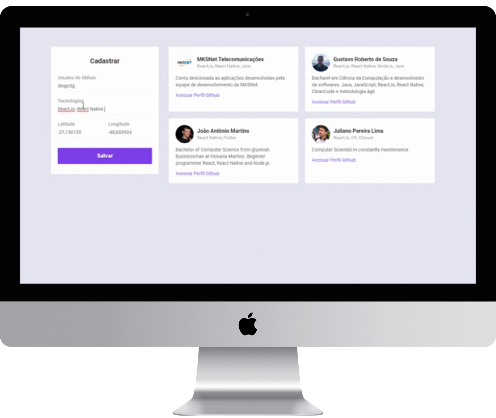

<h1 align="center">
    
</h1>

<h4 align="center">
  🚀 Semana OmniStack 10.0 by RocketSeat
</h4>

  
  

## 📱 Interfaces

A aplicação frontend, assim como a mobile, conta com uma interface principal. Nela é possível ver os _devs_ que já estão cadastrados e também cadastrar novos _devs_. Para realizar o cadastro é necessário informar usuário no github, tecnologia de interesse, latitude e longitude.

    

## 🔄 Executar

- Entrar na pasta `frontend`;
- Executar `yarn install` para instalar dependências do projeto;
- Executar `yarn start` para que o projeto seja executado;

## 📝 Licença

Este projeto está sobre a licença MIT. Veja o arquivo [LICENSE](../LICENSE.md) para mais detalhes.

---

<h4 align="center">
  Feito com ❤️ by Gustavo Souza
</h4>
