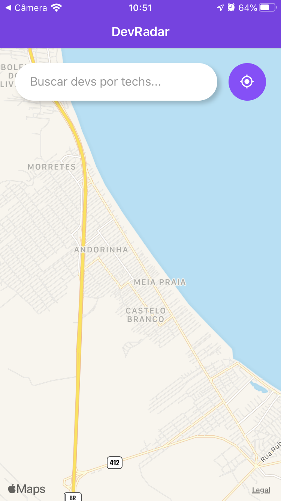
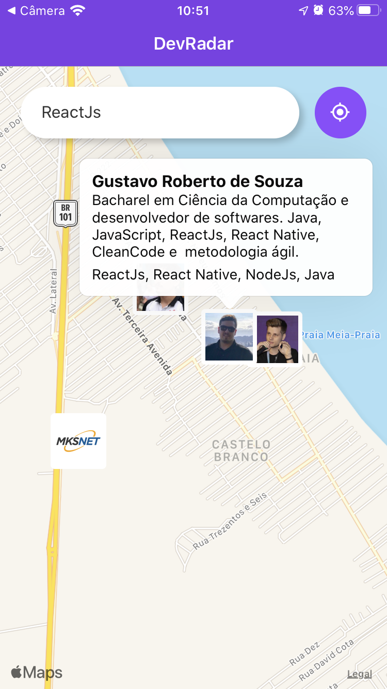
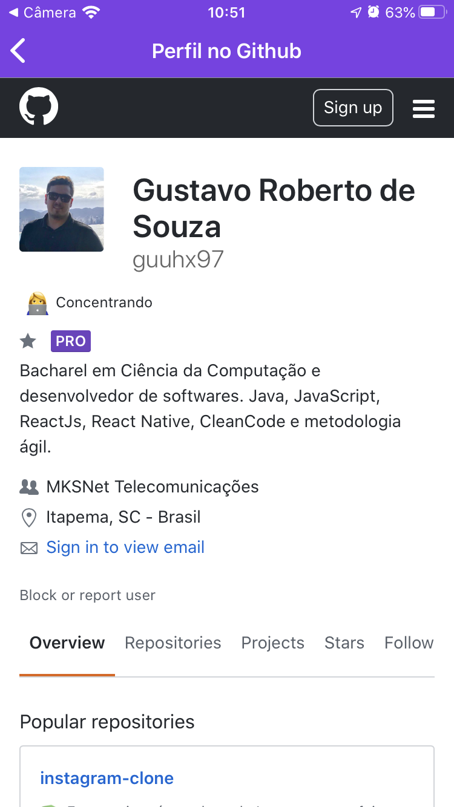

<h1 align="center">
    
</h1>

<h4 align="center">
  🚀 Semana OmniStack 10.0 by RocketSeat
</h4>

  
  

## 📱 Interfaces
O aplicativo mobile do Dev Radar conta com uma interface principal, onde se localiza o mapa e um campo de busca, o qual pode ser utilizado para buscar outros *Devs* próximos e que tenham interesse nas mesmas linguagens. Além diss, é possível abrir o github do dev diretamente pelo aplicativo.

    
    
    
    

## 🔄 Executar
- Entrar na pasta `mobile`;
 - Executar `yarn install` para instalar dependências do projeto;
 - Executar `yarn start` para que o projeto seja executado;

 ## 📝 Licença
Este projeto está sobre a licença MIT. Veja o arquivo [LICENSE](../LICENSE.md) para mais detalhes.

---
<h4 align="center">
  Feito com ❤️ by Gustavo Souza
</h4>
